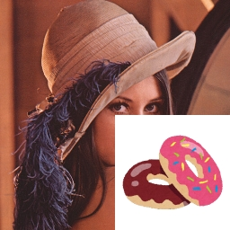
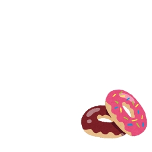
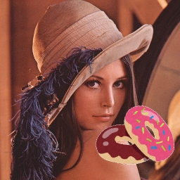

# Advanced program

[back to the top page](../README.md)

---

## Objectives
This page contains challenges using all the techniques you have learned.

## Prerequisite
- You have to finish [basic(2)](../basics/basics_video.md).
- You have to finish [MediaPipe Face](../mediapipe/face.md).

## :o:Challenge[Upon the another image]
### Step1
- Download [`donuts.png`](../image/donuts.png), and save it in `data` folder.
- The following `upon_image1.py` is a sample that is drawn another image upon the original image.
    ```python
    # upon_image1.py
    import cv2
    import numpy as np

    def main():
        img = cv2.imread('./data/lena.jpg')
        fimg = cv2.imread('./data/donuts.png')

        print("Lenna:", img.shape)
        print("donuts:", fimg.shape)

        fh, fw = fimg.shape[:2]
        img[256:256+fh, 256:w+fw] = fimg

        cv2.imshow("mask", img)

        cv2.waitKey(0)
        cv2.destroyAllWindows()

  # run---------------------------------------------------------------------------------------
  if __name__ == '__main__':
      main()
  ```
- You can see the image size of `lena.jpg` as `512 x 512` pixels. And you can see the image size of `donuts.png` as `256 x 256` pixels.
- In `upon_image1.py`, it is considered that `donuts.png` is drawn upon the right-bottom of `lena.jpg`.
- The size of both images has to be the same when a part of `lena.jpg` substitutes `donuts.png`.
    ```python 
        fh, fw = fimg.shape[:2]
        img[256:256+fh, 256:w+fw] = fimg
    ```
    

### Step1 Extra
- If the pasting area exceeds the size of the target image, the above program will result in an error.
- In this case, both the pasting area and the destination area must be adjusted.
#### sample code
```python
h, w = img.shape[:2] # 256x256
fh, fw = fimg.shape[:2] # 512x512

start_y, end_y = -128, -128+fh
start_x, end_x = -128, -128+fw

sy = np.maximum(0, start_y)
sx = np.maximum(0, start_x)
ey = np.minimum(h, end_y)
ex = np.minimum(h, end_x)

fsy = np.maximum(0, 0 - start_y)
fsx = np.maximum(0, 0 - start_x)
fey = fsy + ey - sy
fex = fsx + ex - sx

print(sy, ey, sx, ex, fsy, fey, fsx, fex) # 0 256 0 256 128 384 128 384

img[sy:ey, sx:ex] = fimg[fsy:fey, fsx:fex]
```

### Step2
- You can get the `512 x 512` pixels donuts image with a white background when the following line in `upon_image.py` is replaced. 
  - original code
    ```python 
    img = cv2.imread('./data/lena.jpg')
    ```
  - replaced code
    ```python 
    img = np.ones((512, 512, 3), dtype=np.uint8) * 255
    ```
- `np.ones((512, 512, 3), dtype=np.uint8)` is in order to make the `512`(height) by `512`(width) by `3`(depth) matrix whose elements are ones. Therefore, to use the upper replaced code can get the white image whose size is `512 x 512` pixels.<br>
    

### Step3
- The following `upon_image2.py` is a sample that is drawn another image upon the original image without the background.
```python 
# upon_image2.py
import cv2
import numpy as np

def main():
    lena  = cv2.imread('./data/lena.jpg')
    dnts  = cv2.imread('./data/donuts.png')
    white = np.ones((lena.shape), dtype=np.uint8) * 255 #make a matrix whose size is the same as lena 

    fh, fw = dnts.shape[:2]
    white[256:256+fh,256:256+fw] = dnts

    print([white!=[255,255,255]])

    lena[white!=[255, 255, 255]] = white[white!=[255, 255, 255]]

    cv2.imshow("mask", lena)
    cv2.waitKey(0)
    cv2.destroyAllWindows()

# run---------------------------------------------------------------------------------------
if __name__ == '__main__':
    main()
```
- `[white!=[255,255,255]]` is out the boolean value that each pixel value that is the element in the white matrix is whether equals \[255, 255, 255\].
  - The pixels that make up a part of the donut return "True".
  - The pixels whose colors are equals white (\[255, 255, 255\]) return "False".
- The size of `lena` is same as `white`.
- The following line is in order to replace the pixel values in `lena` to the pixel values in `white`, without its values equals \[255, 255, 255\].
    ```python    
    lena[white!=[255, 255, 255]] = white[white!=[255, 255, 255]]
    ```
    
### Challenge task
- Create the camera viewer that the donuts image is drawn upon each frame.
- To make this program should be modified [`upon_image2.py`](#Step3) or [`upon_image1.py`](#Step1).
- <b>\[Much difficult\]</b> In addition, please try to be resized the donuts image adapted to the size or the position of the one's face, if possible. (You can skip it) 


## :o:Challenge[Hands1]
 - Create an interactive simple game using the information from **hands** by referring to the sample code below.
### `myhands_simplegame.py`
```python
import os
os.environ["OPENCV_VIDEOIO_MSMF_ENABLE_HW_TRANSFORMS"] = "0"
import cv2
import numpy as np
import time
from MediapipeHandLandmark import MediapipeHandLandmark as HandLmk
import random

device = 0 # cameera device number

def get_frame_number(start:float, fps:int):
    now = time.perf_counter() - start
    frame_now = int(now * 1000 / fps)
    return frame_now

def calcAngle(v1, v2):
    v1_n = np.linalg.norm(v1)
    v2_n = np.linalg.norm(v2)
    cos_theta = np.inner(v1, v2) / (v1_n * v2_n)
    return np.rad2deg(np.arccos(cos_theta))

# check the angle between the vertical upward direction and the direction pointed by the index finger
def checkAngle(image, Hand, id_hand):
    angle = 0
    
    ifmcp_landmark_point = Hand.get_landmark(id_hand, Hand.INDEX_FINGER_MCP)

    point_for_text = (ifmcp_landmark_point[0]+10, ifmcp_landmark_point[1])
    cv2.putText(image, str(int(angle)), point_for_text, cv2.FONT_HERSHEY_SIMPLEX, 1, (0,0,255), 2)
    return angle

def main():
    # For webcam input:
    global device

    cap = cv2.VideoCapture(device)
    fps = cap.get(cv2.CAP_PROP_FPS)
    wt  = cap.get(cv2.CAP_PROP_FRAME_WIDTH)
    ht  = cap.get(cv2.CAP_PROP_FRAME_HEIGHT)
    print("Size:", ht, "x", wt, "/Fps: ", fps)

    start = time.perf_counter()
    frame_prv = -1

    wname = 'MediaPipe HandLandmark'
    cv2.namedWindow(wname, cv2.WINDOW_NORMAL)

    Hand = HandLmk()

    flag = 0
    quest = random.randint(1, 359)
    msg1 = ""
    msg2 = ""
    while cap.isOpened():
        frame_now = get_frame_number(start, fps)
        if frame_now == frame_prv:
            continue
        frame_prv = frame_now

        ret, frame = cap.read()
        if not ret:
            print("Ignoring empty camera frame.")
            # If loading a video, use 'break' instead of 'continue'.
            continue

        # Flip the image horizontally for a later selfie-view display, and convert
        flipped_frame = cv2.flip(frame, 1)
    
        results = Hand.detect(flipped_frame)

        # Display the message
        cv2.rectangle(flipped_frame, (0, 80), (int(wt), 110), (255,255,255), -1)
        msg1 = "Point in the direction of " + str(quest) + " degrees"
        cv2.putText(flipped_frame, "Reset[r key], Exit[q key]", (100, int(ht)-50), cv2.FONT_HERSHEY_COMPLEX_SMALL, 1, (0,0,255),1)
        cv2.putText(flipped_frame, msg1, (100, 100), cv2.FONT_HERSHEY_COMPLEX_SMALL, 1, (0,0,0),1)
        cv2.putText(flipped_frame, msg2, (100, 200), cv2.FONT_HERSHEY_COMPLEX_SMALL, 5, (0,255,0),3)
        if Hand.num_detected_hands > 0:
            id_hand = 0
            if flag == 0:
                if int(checkAngle(flipped_frame, Hand, id_hand)) == quest:
                    flag = 1

        cv2.imshow(wname, flipped_frame)

        if flag == 1:
            msg2 = "ok!"
        key = cv2.waitKey(5) & 0xFF
        if key == ord('r'):
            flag = 0
            msg2 = ""
            quest = random.randint(1, 359)
        elif key == ord('q'):
            break
    cap.release()

if __name__ == '__main__':
    main()
```
 - In this sample code, 1 to 359 degrees are displayed randomly, and "OK!" is displayed when the user points to the same angle.
 - In the `checkAngle` function, the angle between the vertical upward direction and the index finger is calculated by following `calcAngle2D_againstY`.
    - sample code
    ```python
    def calcAngle2D_againstY(v1):
        angle = np.arctan2(v1[0], v1[1]) # np.arctan2(y, x) under normal
        if angle < 0:
            return 360 + np.rad2deg(angle)
        else:
            return np.rad2deg(angle)
    ```
 - **Complete the `checkAngle` function.**<br>
  <image src="../image/angle_app.gif" width="30%" height="30%"><br>

## Challenge[Face1]
 - Display the face direction randomly, and show how many times you have turned your face to the direction.<br>
 <image src="../image/face_app.gif" width="30%" height="30%"><br>
 - Use the following code to randomly generate an integer. In this code, `random.randint(0, 5)` returns a random integer int with `0<=n<=5`.
````python
    import random
    random.randint(0, 5)
````
 - You can randomly select and display the elements of the array with the following code.
````python
   msg_array = ("msg1", "msg2", "msg3")
   select = msg_array[random.randint(0, len(msg_array)-1)]
   print(select)
````
- Facial orientation can be determined, for example, by the vector from the center of gravity of the all face landmarks to the head of the nose.
 
---
    
[back to the top page](../README.md)
