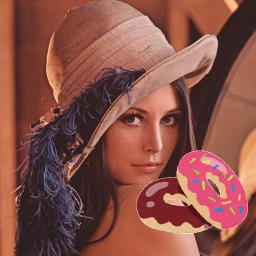

# Advanced program

[back to the top page](../README.md)

---

## Objectives
This page contains challenges using all the techniques you have learned.

## Prerequisite
- You have to finish the followings.
    - [Image processing basics for static image](../image_processing/basics_image.md)
    - [Image processing basics for video](../image_processing/basics_video.md)

## :o:Challenge[Upon the another image]
### Step1
- Download [`lenna512.bmp`](../img/lenna512.bmp) and [`donuts.png`](../img/donuts.png), and save it in `img` folder.
- The following `upon_image1.py` is a sample that is drawn another image upon the original image.
    ```python
    # upon_image1.py
    import cv2
    import numpy as np

    def main():
        img = cv2.imread('./img/lenna512.bmp')
        fimg = cv2.imread('./img/donuts.png')

        print("Lenna512:", img.shape)
        print("donuts:", fimg.shape)

        fh, fw = fimg.shape[:2]
        img[256:256+fh, 256:256+fw] = fimg

        cv2.imshow("mask", img)

        cv2.waitKey(0)
        cv2.destroyAllWindows()

  # run---------------------------------------------------------------------------------------
  if __name__ == '__main__':
      main()
  ```
- You can see the image size of `lenna512.bmp` as `512 x 512` pixels. And you can see the image size of `donuts.png` as `256 x 256` pixels.
- In `upon_image1.py`, it is considered that `donuts.png` is drawn upon the right-bottom of `lenna512.bmp`.
- The size of both images has to be the same when a part of `lenna512.bmp` substitutes `donuts.png`.
    ```python
    fh, fw = fimg.shape[:2]
    img[256:256+fh, 256:w+fw] = fimg
    ```
    

### Step1 Extra
- If the pasting area exceeds the size of the target image, the above program will result in an error.
- In this case, both the pasting area and the destination area must be adjusted.
#### sample code
```python
h, w = img.shape[:2] # 256x256
fh, fw = fimg.shape[:2] # 512x512

start_y, end_y = -128, -128+fh
start_x, end_x = -128, -128+fw

sy = np.maximum(0, start_y)
sx = np.maximum(0, start_x)
ey = np.minimum(h, end_y)
ex = np.minimum(h, end_x)

fsy = np.maximum(0, 0 - start_y)
fsx = np.maximum(0, 0 - start_x)
fey = fsy + ey - sy
fex = fsx + ex - sx

print(sy, ey, sx, ex, fsy, fey, fsx, fex) # 0 256 0 256 128 384 128 384

img[sy:ey, sx:ex] = fimg[fsy:fey, fsx:fex]
```

### Step2
- You can get the `512 x 512` pixels donuts image with a white background when the following line in `upon_image.py` is replaced.
  - original code
    ```python
    img = cv2.imread('./img/lenna512.bmp')
    ```
  - replaced code
    ```python
    img = np.ones((512, 512, 3), dtype=np.uint8) * 255
    ```
- `np.ones((512, 512, 3), dtype=np.uint8)` is in order to make the `512`(height) by `512`(width) by `3`(depth) matrix whose elements are ones. Therefore, to use the upper replaced code can get the white image whose size is `512 x 512` pixels.<br>
    

### Step3
- The following `upon_image2.py` is a sample that is drawn another image upon the original image without the background.
    ```python
    # upon_image2.py
    import cv2
    import numpy as np

    def main():
        lenna  = cv2.imread('./img/lenna512.bmp')
        dnts  = cv2.imread('./img/donuts.png')
        white = np.ones_like(lenna) * 255 #make a matrix whose size and type are the same as lenna

        fh, fw = dnts.shape[:2]
        white[256:256+fh,256:256+fw] = dnts

        print([white!=[255,255,255]])

        lenna[white!=[255, 255, 255]] = white[white!=[255, 255, 255]]

        cv2.imshow("mask", lenna)
        cv2.waitKey(0)
        cv2.destroyAllWindows()

    # run---------------------------------------------------------------------------------------
    if __name__ == '__main__':
        main()
    ```
- `[white!=[255,255,255]]` is out the boolean value that each pixel value that is the element in the white matrix is whether equals \[255, 255, 255\].
  - The pixels that make up a part of the donut return `True`.
  - The pixels whose colors are equals white (\[255, 255, 255\]) return `False`.
- The size of `lenna` is same as `white`.
- The following line is in order to replace the pixel values in `lenna` to the pixel values in `white`, without its values equals \[255, 255, 255\].
    ```python
    lenna[white!=[255, 255, 255]] = white[white!=[255, 255, 255]]
    ```
    
### Challenge task
- Create the camera viewer that the donuts image is drawn upon each frame.
- To make this program should be modified [`upon_image2.py`](#Step3) or [`upon_image1.py`](#Step1).
- <b>\[Much difficult\]</b> In addition, please try to be resized the donuts image adapted to the size or the position of the one's face, if possible. (You can skip it)


---

[back to the top page](../README.md)
