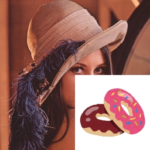
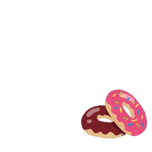

# Advanced program

[back to the top page](../README.md)

---

## Objectives
This page contains challenges using all the techniques you have learned.

## Prerequisite
- You have to finish the followings.
    - [Image processing basics for static image](../image_processing/basics_image.md)
    - [Image processing basics for video](../image_processing/basics_video.md)

## :o:Challenge[Upon the another image]
### Step1
- Download [`donuts.png`](../image/donuts.png), and save it in `data` folder.
- The following `upon_image1.py` is a sample that is drawn another image upon the original image.
    ```python
    # upon_image1.py
    import cv2
    import numpy as np

    def main():
        img = cv2.imread('./data/lena.jpg')
        fimg = cv2.imread('./data/donuts.png')

        print("Lenna:", img.shape)
        print("donuts:", fimg.shape)

        fh, fw = fimg.shape[:2]
        img[256:256+fh, 256:w+fw] = fimg

        cv2.imshow("mask", img)

        cv2.waitKey(0)
        cv2.destroyAllWindows()

  # run---------------------------------------------------------------------------------------
  if __name__ == '__main__':
      main()
  ```
- You can see the image size of `lena.jpg` as `512 x 512` pixels. And you can see the image size of `donuts.png` as `256 x 256` pixels.
- In `upon_image1.py`, it is considered that `donuts.png` is drawn upon the right-bottom of `lena.jpg`.
- The size of both images has to be the same when a part of `lena.jpg` substitutes `donuts.png`.
    ```python
    fh, fw = fimg.shape[:2]
    img[256:256+fh, 256:w+fw] = fimg
    ```
    

### Step1 Extra
- If the pasting area exceeds the size of the target image, the above program will result in an error.
- In this case, both the pasting area and the destination area must be adjusted.
#### sample code
```python
h, w = img.shape[:2] # 256x256
fh, fw = fimg.shape[:2] # 512x512

start_y, end_y = -128, -128+fh
start_x, end_x = -128, -128+fw

sy = np.maximum(0, start_y)
sx = np.maximum(0, start_x)
ey = np.minimum(h, end_y)
ex = np.minimum(h, end_x)

fsy = np.maximum(0, 0 - start_y)
fsx = np.maximum(0, 0 - start_x)
fey = fsy + ey - sy
fex = fsx + ex - sx

print(sy, ey, sx, ex, fsy, fey, fsx, fex) # 0 256 0 256 128 384 128 384

img[sy:ey, sx:ex] = fimg[fsy:fey, fsx:fex]
```

### Step2
- You can get the `512 x 512` pixels donuts image with a white background when the following line in `upon_image.py` is replaced.
  - original code
    ```python
    img = cv2.imread('./data/lena.jpg')
    ```
  - replaced code
    ```python
    img = np.ones((512, 512, 3), dtype=np.uint8) * 255
    ```
- `np.ones((512, 512, 3), dtype=np.uint8)` is in order to make the `512`(height) by `512`(width) by `3`(depth) matrix whose elements are ones. Therefore, to use the upper replaced code can get the white image whose size is `512 x 512` pixels.<br>
    

### Step3
- The following `upon_image2.py` is a sample that is drawn another image upon the original image without the background.
```python
# upon_image2.py
import cv2
import numpy as np

def main():
    lena  = cv2.imread('./data/lena.jpg')
    dnts  = cv2.imread('./data/donuts.png')
    white = np.ones((lena.shape), dtype=np.uint8) * 255 #make a matrix whose size is the same as lena

    fh, fw = dnts.shape[:2]
    white[256:256+fh,256:256+fw] = dnts

    print([white!=[255,255,255]])

    lena[white!=[255, 255, 255]] = white[white!=[255, 255, 255]]

    cv2.imshow("mask", lena)
    cv2.waitKey(0)
    cv2.destroyAllWindows()

# run---------------------------------------------------------------------------------------
if __name__ == '__main__':
    main()
```
- `[white!=[255,255,255]]` is out the boolean value that each pixel value that is the element in the white matrix is whether equals \[255, 255, 255\].
  - The pixels that make up a part of the donut return "True".
  - The pixels whose colors are equals white (\[255, 255, 255\]) return "False".
- The size of `lena` is same as `white`.
- The following line is in order to replace the pixel values in `lena` to the pixel values in `white`, without its values equals \[255, 255, 255\].
    ```python
    lena[white!=[255, 255, 255]] = white[white!=[255, 255, 255]]
    ```
    
### Challenge task
- Create the camera viewer that the donuts image is drawn upon each frame.
- To make this program should be modified [`upon_image2.py`](#Step3) or [`upon_image1.py`](#Step1).
- <b>\[Much difficult\]</b> In addition, please try to be resized the donuts image adapted to the size or the position of the one's face, if possible. (You can skip it)


---

[back to the top page](../README.md)


================


# Show face orientation
## Sample code[Face]
 - Display "left" or "right" according to the orientation of the face.
 - There are several judgment methods, but the simple one is a judgment method that compares the x-coordinates of several landmarks.<br>
    <image src="../image/q2_face.gif" width="30%" height="30%"><br>

Type the following template. It's OK copy and paste.

```python
import cv2
import mediapipe as mp
import numpy as np
mp_drawing = mp.solutions.drawing_utils
mp_face_mesh = mp.solutions.face_mesh

device = 0 # cameera device number

def main():
    # For webcam input:
    drawing_spec = mp_drawing.DrawingSpec(thickness=1, circle_radius=1)
    cap = cv2.VideoCapture(device)

    face_mesh = mp_face_mesh.FaceMesh(
    min_detection_confidence=0.5,
    min_tracking_confidence=0.5)

    while cap.isOpened():
        ret, frame = cap.read()
        if not ret:
            print("Ignoring empty camera frame.")
            # If loading a video, use 'break' instead of 'continue'.
            continue

        # Flip the image horizontally for a later selfie-view display, and convert
        # the BGR image to RGB.
        frame = cv2.cvtColor(cv2.flip(frame, 1), cv2.COLOR_BGR2RGB)
        # To improve performance, optionally mark the image as not writeable to
        # pass by reference.
        frame.flags.writeable = False
        results = face_mesh.process(frame)

        # Draw the face mesh annotations on the image.
        frame.flags.writeable = True
        frame = cv2.cvtColor(frame, cv2.COLOR_RGB2BGR)
        if results.multi_face_landmarks:
            for face_landmarks in results.multi_face_landmarks:
                #mp_drawing.draw_landmarks(image, face_landmarks, mp_face_mesh.FACE_CONNECTIONS)
                face_orientation(frame, face_landmarks)
        cv2.imshow('MediaPipe FaceMesh', frame)
        if cv2.waitKey(5) & 0xFF == 27:
            break
    cap.release()

def face_orientation(image, landmarks):
    image_width, image_height = image.shape[1], image.shape[0]
    landmark_point = []

    for index, landmark in enumerate(landmarks.landmark):
        if landmark.visibility < 0 or landmark.presence < 0:
            continue

        # Convert the obtained landmark values x, y, z to the coordinates on the image
        landmark_x = min(int(landmark.x * image_width), image_width - 1)
        landmark_y = min(int(landmark.y * image_height), image_height - 1)
        landmark_z = landmark.z

        landmark_point.append(np.array([landmark_x, landmark_y, landmark_z], dtype=int))

    cx = 0
    cy = 0
    if len(landmark_point) != 0:
        for i in range(0, len(landmark_point)):
            cx += landmark_point[i][0]
            cy += landmark_point[i][1]
            cv2.circle(image, (int(landmark_point[i][0]),int(landmark_point[i][1])), 1, (0, 255, 0), 1)
        cx = int(cx/len(landmark_point))
        cy = int(cy/len(landmark_point))

        # top
        cv2.circle(image, (int(landmark_point[10][0]),int(landmark_point[10][1])), 5, (255, 255, 0), 1)
        # bottom
        cv2.circle(image, (int(landmark_point[152][0]),int(landmark_point[152][1])), 5, (255, 255, 0), 1)
        # left
        cv2.circle(image, (int(landmark_point[234][0]),int(landmark_point[234][1])), 5, (255, 255, 0), 1)
        # right
        cv2.circle(image, (int(landmark_point[454][0]),int(landmark_point[454][1])), 5, (255, 255, 0), 1)
        # center
        cv2.circle(image, (int(landmark_point[0][0]),int(landmark_point[0][1])), 5, (255, 255, 0), 1)

        l = cx - landmark_point[234][0]
        r = landmark_point[454][0] - cx

        if abs(l) > 5*abs(r):
            cv2.putText(image, "right", (100, 100), cv2.FONT_HERSHEY_SIMPLEX, 3, (0,0,255),5)
        elif 5*abs(l) < abs(r):
            cv2.putText(image, "left", (100, 100), cv2.FONT_HERSHEY_SIMPLEX, 3, (0,0,255),5)

if __name__ == '__main__':
    main()
```