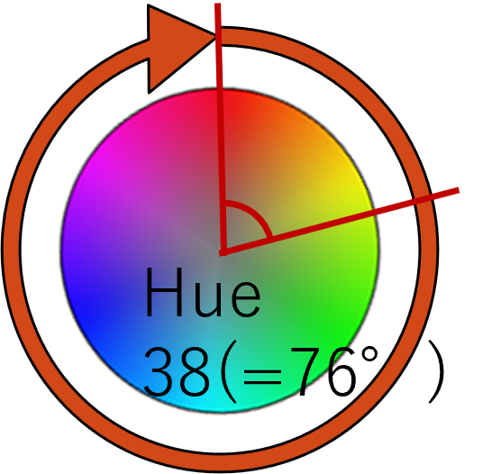
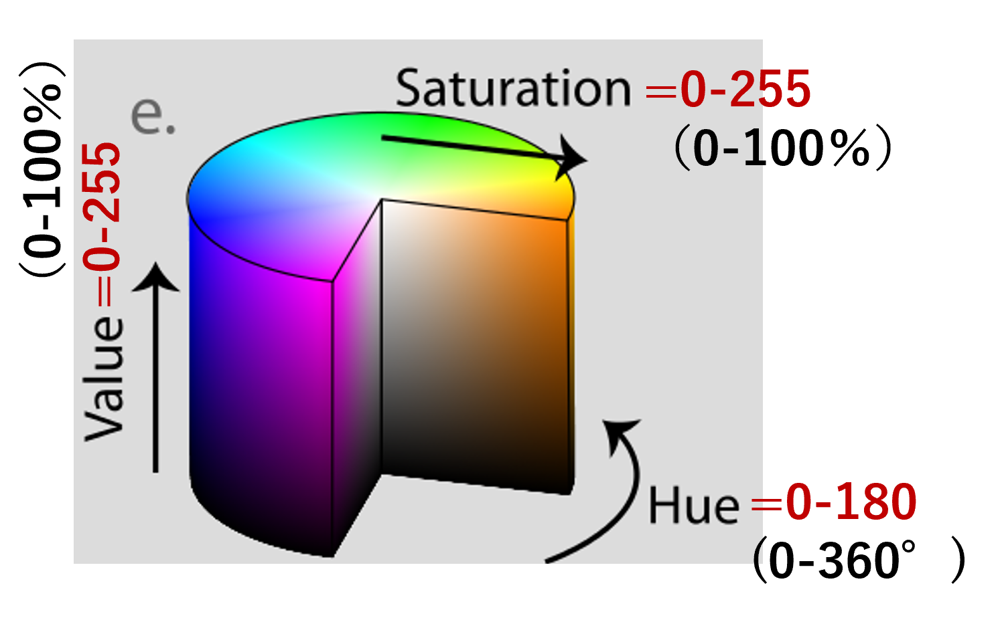

```markdown
# Advanced Image Processing: HSV Color Space and AR Markers

[back to the top page](../README.md)

---

### :red_square: Color space (HSV color space)

* Color can also be represented by HSV color space instead of RGB.
* **HSV** stands for **Hue**, **Saturation**, and **Value**.
* **Hue**: Color type (e.g., Red, Yellow, Green, Blue) represented by angle ($0$ to $360^\circ$).
* **Saturation**: Vividness of color.
* **Value**: Brightness of color.

#### Features of HSV color space

* It is **reversibly convertible** with RGB.
* It allows for more **intuitive color handling**, making it easy to specify areas like "a range of yellowish colors".

#### Data Range in OpenCV

When using OpenCV (`cv2`), the data ranges are scaled to fit within 8-bit integer values ($0$ to $255$):

* **Hue**: $0$ to $180$ (The actual angle $0$ to $360^\circ$ is divided by 2. For example, Hue = $38$ represents $38 \times 2 = 76^\circ$).
* **Saturation**: $0$ to $255$ ($0$ to $100\%$).
* **Value**: $0$ to $255$ ($0$ to $100\%$).

<div align="center">
  
</div>

#### :blue_square: Color conversion with `cv2`

* You can convert a BGR image to an HSV image using the following function:
```python
hsv = cv2.cvtColor(img, cv2.COLOR_BGR2HSV)

```

#### :o:Practice [HSV color space]

* Save the following sample code as a python file, and execute it. (`C:/oit/py25en/source/sample_hsv.py`)
* `sample_hsv.py`

```python
import cv2
import numpy as np

# Read image file
img = cv2.imread('./img/standard/Mandrill.bmp')
if img is None:
    print('ERROR: image file is not opened.')
    exit(1)

# Convert BGR to HSV color space
hsv = cv2.cvtColor(img, cv2.COLOR_BGR2HSV)

# Split into H, S, V channels
h, s, v = cv2.split(hsv)

# Show each channel as a grayscale image
cv2.imshow('Original', img)
cv2.imshow('Hue channel', h)
cv2.imshow('Saturation channel', s)
cv2.imshow('Value channel', v)

cv2.waitKey(0)
cv2.destroyAllWindows()

```

* It is O.K., if the windows pop up and you can observe how the components of Hue, Saturation, and Value are separated.

---

### :red_square: Advanced Application: Color Extraction using HSV

By analyzing pixel values in the HSV color space, we can define a specific range of values to extract target objects from an image.

#### :o:Exercise [Color Extraction]

* Let's find the proper HSV thresholds of the **pink box** using the interactive tool, and then complete the program to extract it.

##### 1. Find HSV values using `color_picker.py`

* Run the distributed [`color_picker.py`](https://www.google.com/search?q=color_picker.py) program.
* **Click several different points** inside the pink box (such as the brightest areas, darker shaded areas, and average areas).
* Observe the $(H, S, V)$ values printed in the terminal each time to find the minimum and maximum values of the pink region.

##### 2. Concept of Color Extraction

To extract a specific color, we filter the HSV image by defining a lower and upper boundary for each channel. Pixels that fall within this range form a **Binary Mask** (White = Target color, Black = Others). By combining this mask with the original image using a bitwise AND operation, we can isolate the target object.

> 💡 **How to set `lower_pink` and `upper_pink`:**
> Look at the multiple $(H, S, V)$ values you gathered by clicking around the box:
> * **`lower_pink`**: Set values slightly lower than the *minimum* H, S, and V you observed.
> * **`upper_pink`**: Set values slightly higher than the *maximum* H, S, and V you observed.
> 
> 

##### 3. Complete the Extraction Program (`extract_color.py`)

* Save the following code as `extract_color.py`.
* **Modify `lower_pink` and `upper_pink` values** by inputting the HSV range you discovered in Step 1, then run the program.

```python
import cv2
import numpy as np

def main():
    # 1. Read the image
    img = cv2.imread("./img/static_b.png")
    if img is None:
        print('ERROR: image file is not opened.')
        exit(1)

    # 2. Convert to HSV color space
    hsv = cv2.cvtColor(img, cv2.COLOR_BGR2HSV)

    # 3. Define the range of pink color in HSV
    # TODO: Input your measured HSV range here! [Hue, Saturation, Value]
    lower_pink = np.array([140,  50,  50])
    upper_pink = np.array([170, 255, 255])

    # 4. Create a mask image (pixels within range become 255, others become 0)
    mask = cv2.inRange(hsv, lower_pink, upper_pink)

    # 5. Extract the pink region using bitwise AND operation
    result = cv2.bitwise_and(img, img, mask=mask)

    # 6. Show the results
    cv2.imshow("Original Image", img)
    cv2.imshow("Mask (White = Pink Area)", mask)
    cv2.imshow("Extracted Pink Box", result)

    cv2.waitKey(0)
    cv2.destroyAllWindows()

if __name__ == '__main__':
    main()

```

* It's O.K. if the `Extracted Pink Box` window completely separates the pink box from the background space.

---

### :red_square: Advanced Application: AR Marker Generation and Detection

An **AR marker** (such as an ArUco marker) is a distinct square pattern used in computer vision to determine positions, orientations, and object identities.

#### :o:Exercise [AR Marker Overlay]

* Let's understand how to generate and detect AR markers using OpenCV, and then complete a program to overlay dynamic card images on top of detected markers.

##### 1. Generating an AR Marker (`ipB_generateARmarker.py`)

* To create a marker, you select a predefined dictionary (a set of marker patterns) and specify a unique marker ID along with the output pixel size.
* Save the following code as `ipB_generateARmarker.py`.
* **Complete the `TODO` sections** by filling integers into `id` and `sidePixels` to generate your marker image.

```python
import cv2

def main():
    # Select a 4x4 pixel marker dictionary containing 50 unique IDs
    dictionary = cv2.aruco.getPredefinedDictionary(cv2.aruco.DICT_4X4_50)

    # TODO: Fill appropriate integers into id and sidePixels!
    id = 
    sidePixels = 
    
    # Generate the marker image
    try:
        marker = cv2.aruco.drawMarker(dictionary, id, sidePixels)
    except AttributeError:
        marker = cv2.aruco.generateImageMarker(dictionary, id, sidePixels)
    
    cv2.imwrite('marker.png', marker)

if __name__ == '__main__':
    main()

```

##### 2. Concept of AR Marker Detection

* When capturing or reading an image containing markers, the system returns their exact corner locations and identified IDs.

```python
# Detect markers in an image
dictionary = cv2.aruco.getPredefinedDictionary(cv2.aruco.DICT_4X4_50)

# TODO: Fill variables to catch the return values!
________, ______, rejectedImgPoints = cv2.aruco.detectMarkers(img, dictionary)

# Draw green borders and ID text over the detected markers (Overwrites 'img')
cv2.aruco.drawDetectedMarkers(img, corners, ids, (0, 255, 0))

```

> 💡 **Key Variables to Use:**
> Out of the returned data, we focus only on **`corners`** and **`ids`**:
> * **`corners`**: The coordinate pairs of the detected marker's four corners.
> * **`ids`**: The unique marker ID integer mapped to each detected pattern.
> 
> 

> 🔑 **Supplementary Note: Multiple Return Values in Python**
> The function `cv2.aruco.detectMarkers()` returns multiple outputs simultaneously. Python handles multiple return values smoothly by unpacking them directly into variables. You have already encountered this feature across other OpenCV operations:
> * **Splitting Color Channels**: `b, g, r = cv2.split(img)`
> * **Reading Video Frames**: `ret, frame = cap.read()`
> * **Getting Image Dimensions**: `h, w, c = img.shape`
> 
> 

##### 3. Complete the Overlay Program (`ipB_detectARmarker.py`)

* Open the distributed [`ipB_detectARmarker.py`](https://www.google.com/search?q=ipB_detectARmarker.py) file.
* **Complete the `TODO` sections** to detect the markers from the scene image (`balanced_random_markers.png`) and overlay the matching cat-themed playing card images (`0.png` to `6.png`) based on the detected IDs.

```python
import cv2
import numpy as np
import os

def get_card_filename(marker_id):
    """Maps a marker ID to its corresponding playing card image file."""
    if marker_id == 0:
        return '0.png'    # Joker
    elif marker_id == 1:
        return '1cl.png'  # Club Ace
    elif marker_id == 2:
        return '1di.png'  # Diamond Ace
    elif marker_id == 3:
        return '1ht.png'  # Heart Ace
    elif marker_id == 4:
        return '1sp.png'  # Spade Ace
    elif 5 <= marker_id <= 9:
        # Map IDs 5-9 to card images 2.png to 6.png
        return f"{marker_id - 3}.png"
    else:
        return '0.png'

def main():
    # 1. Load the scene containing generated markers
    scene_img = cv2.imread("balanced_random_markers.png")
    if scene_img is None:
        print("ERROR: balanced_random_markers.png not found.")
        return
    
    output_img = scene_img.copy()

    # 2. Initialize the ARuCo detector dictionary
    try:
        dictionary = cv2.aruco.getPredefinedDictionary(cv2.aruco.DICT_4X4_50)
    except AttributeError:
        dictionary = cv2.aruco.getPredefinedDictionary(0)
        
    # TODO: Detect the markers embedded inside the scene using appropriate variables
    ________, ______, _ = cv2.aruco.detectMarkers(scene_img, dictionary)

    if ids is None:
        print("No AR markers were detected.")
        return

    # 3. Loop through every detected marker and overlay its designated image
    for i, marker_id in enumerate(ids.flatten()):
        
        # TODO: Extract the 4 corner coordinates for the current marker and reshape to (4, 2)
        marker_corners = _________[i].reshape((4, 2))
        
        # Determine the target overlay card file name based on the detected ID
        card_file = get_card_filename(marker_id)
        if not os.path.exists(card_file):
            continue
            
        card_img = cv2.imread(card_file)
        ch, cw = card_img.shape[:2]

        # Define source points from the card image corners
        src_pts = np.array([
            [0, 0],
            [cw - 1, 0],
            [cw - 1, ch - 1],
            [0, ch - 1]
        ], dtype=np.float32)

        # Destination points correspond directly to the detected marker corners
        dst_pts = marker_corners.astype(np.float32)

        # Compute Perspective Transformation matrix and warp the card image
        M = cv2.getPerspectiveTransform(src_pts, dst_pts)
        sh, sw = scene_img.shape[:2]
        warped_card = cv2.warpPerspective(card_img, M, (sw, sh), flags=cv2.INTER_LINEAR, borderValue=(255, 255, 255))

        # Create a mask to composite the card onto the scene background
        mask = np.zeros((sh, sw), dtype=np.uint8)
        cv2.fillConvexPoly(mask, dst_pts.astype(np.int32), 255)
        
        mask_inv = cv2.bitwise_not(mask)
        output_img = cv2.bitwise_and(output_img, output_img, mask=mask_inv)
        card_area = cv2.bitwise_and(warped_card, warped_card, mask=mask)
        output_img = cv2.add(output_img, card_area)

    # 4. Show final result
    cv2.imshow('Final Card Overlay Result', output_img)
    cv2.waitKey(0)
    cv2.destroyAllWindows()

if __name__ == '__main__':
    main()

```

* It's O.K. if your final display window cleanly places the cute matching card items exactly over each scrambled black-and-white square target area!

---

[back to the top page](https://www.google.com/search?q=../README.md)

```

```
